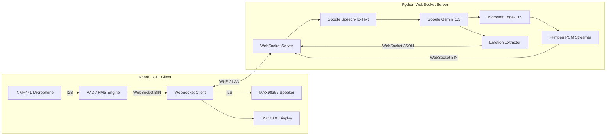
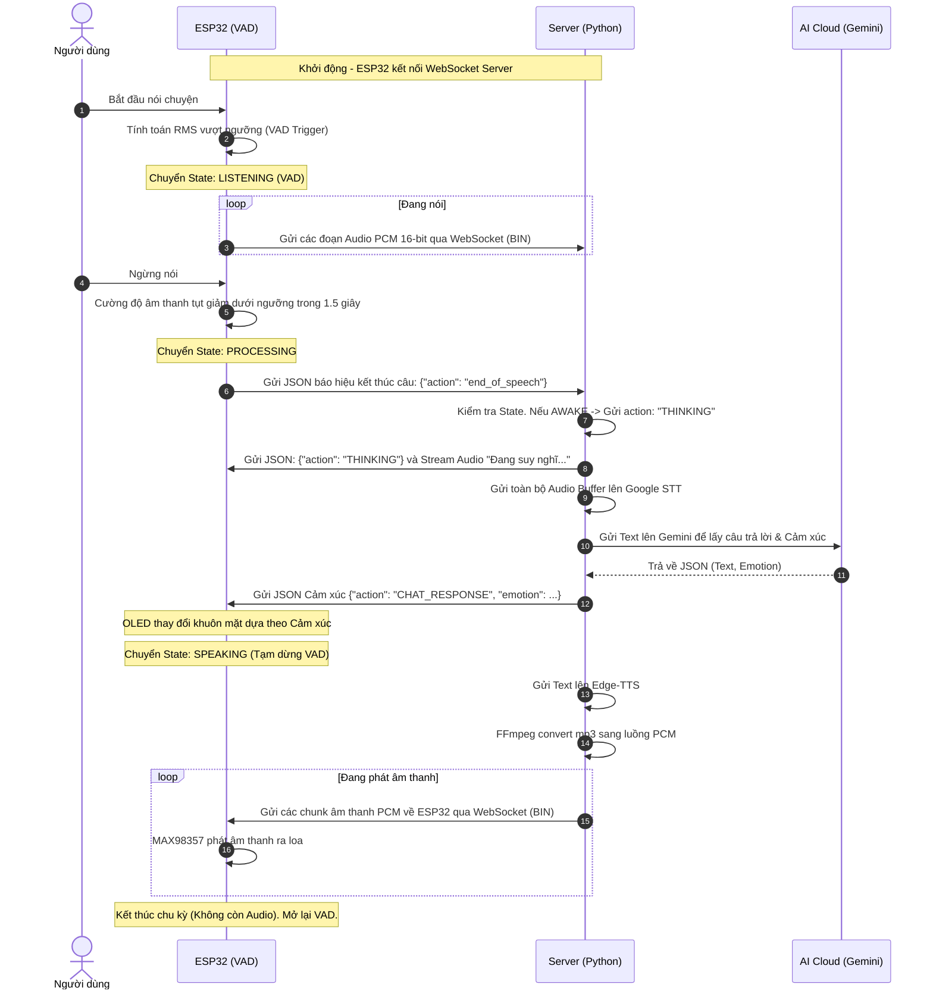

# Khái quát Kiến trúc Hệ thống

Dự án Robot ESP32 hoạt động theo mô hình Client-Server. Trong đó, phần cứng nhúng (ESP32) đóng vai trò là Client phụ trách giao tiếp vật lý, còn Python đóng vai trò Server đảm nhiệm toàn bộ sức mạnh xử lý AI, phân tích và trích xuất. Sự phân chia này giúp ESP32 chạy cực kỳ nhẹ nhàng mà vẫn mang lại cảm giác thông minh.

## 1. Sơ đồ Hoạt động Tổng quan (High-level Architecture)

Giao tiếp giữa 2 khối được thực hiện hoàn toàn qua giao thức **WebSocket** (Full-Duplex), đảm bảo độ trễ thấp nhất có thể cho một luồng hội thoại.

## 2. Các pha giao tiếp (Chu kỳ hỏi - đáp)

Thay vì thiết kế dạng nút bấm "nhấn để nói" (Push-to-talk), hệ thống được cấu trúc dựa trên **State Machine** (Máy trạng thái) hoàn toàn Rảnh tay (Hands-free). 

Chu kỳ của một cuộc hội thoại tuân theo biểu đồ tuần tự sau:

## 3. Lý do sử dụng WebSocket Streaming thay vì HTTP REST

- **Độ trễ thấp:** Dữ liệu âm thanh được bơm (stream) trực tiếp thành các cục (chunk) nhỏ `1024 bytes` mà không cần đợi đóng gói thành một file khổng lồ, loại bỏ toàn bộ overhead của HTTP Header.
- **Phát lại tức thì (Real-time Playback):** Nhờ việc Server phân rã âm thanh bằng `FFmpeg` thành PCM thô và đẩy qua WebSocket, ESP32 chỉ việc vứt thẳng luồng byte này vào IC MAX98357 mà không cần đủ bộ nhớ RAM để tải về hay giải mã MP3.
- **Tiết kiệm tài nguyên:** ESP32 không phải chạy Web Server hay chờ HTTP Response Blocking, nó có dư thời gian để chạy hoạt ảnh GIF 30 fps trên OLED.
